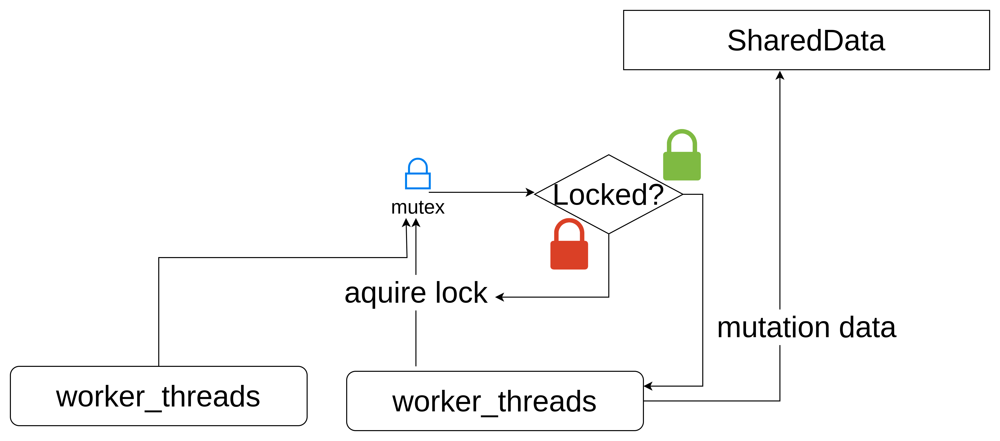

# shared web worker sample

This project is to demo how shared web worker could be used in two html file

## worker types

### Web Worker

response for a single web page , for help offload  heavy CPU intensive job

### Shared Worker

response for multiple web page on same origin communication, for help transfer data between multiple pages

### Service Worker

proxy between the browser and api server, only could host on https or localhost, for help local cache with localStorage when internet is not good


## Nodejs Concurreny

for weather  need to integrate process result classify into 2 ways:

### Cluster Mode

That means we fork main process with seperate child process to handle the job, however, each indiviual process will not shared memory.

The responsibility for main process is to dispatcher job for child process。

### worker thread

That means we create multiple worker_threadd from main thread. this time, worker could shared data with SharedBufferArray, or use MessageChannel。

***Notice***: need to modify response header for use SharedArrayBuffer on Browser side

### exec webside with enable SharedArrayBuffer

```shell
npx serve -C web
```
serve with read web/serve.json to setup response header

## WorkPool strategy

Worker Pool 目的，最大化平行處理相同的工作
1. roundrobin

每次照循環順序，逐步分派給對應的 worker 工作

2. random

隨機分派給一個 worker 工作

3. leastbusy

分派給當下處理工作量最少的 worker 處理

## mutex

