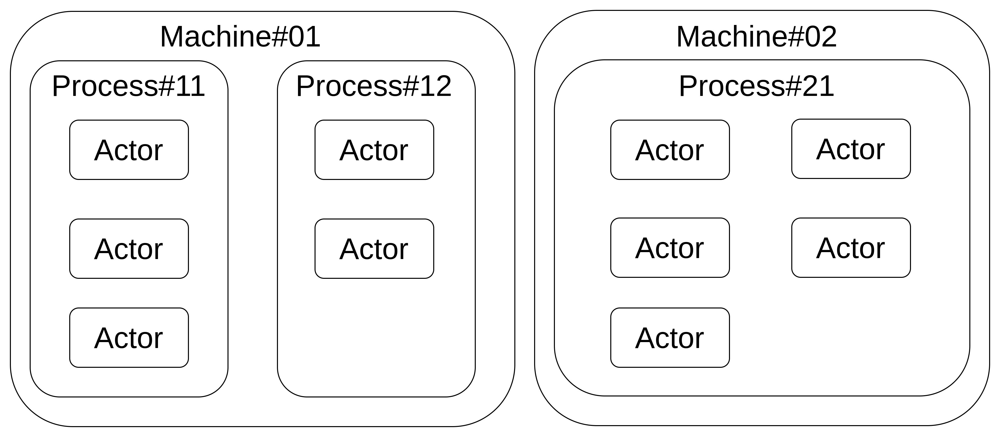

# shared web worker sample

This project is to demo how shared web worker could be used in two html file

## worker types

### Web Worker

response for a single web page , for help offload  heavy CPU intensive job

### Shared Worker

response for multiple web page on same origin communication, for help transfer data between multiple pages

### Service Worker

proxy between the browser and api server, only could host on https or localhost, for help local cache with localStorage when internet is not good


## Nodejs Concurreny

for weather  need to integrate process result classify into 2 ways:

### Cluster Mode

That means we fork main process with seperate child process to handle the job, however, each indiviual process will not shared memory.

The responsibility for main process is to dispatcher job for child process。

### worker thread

That means we create multiple worker_threadd from main thread. this time, worker could shared data with SharedBufferArray, or use MessageChannel。

***Notice***: need to modify response header for use SharedArrayBuffer on Browser side

### exec webside with enable SharedArrayBuffer

```shell
npx serve -C web
```
serve with read web/serve.json to setup response header

## WorkPool strategy

Worker Pool 目的，最大化平行處理相同的工作
1. roundrobin

每次照循環順序，逐步分派給對應的 worker 工作

2. random

隨機分派給一個 worker 工作

3. leastbusy

分派給當下處理工作量最少的 worker 處理

## mutex


## ring-buffer

當在處理一序列資料，當資料大小超過內核(kernel)緩衝區大小時。會採取把資料切分成固定區快來逐步處理。而適合處理這類型行為的資料型別就是環形緩衝區(ring buffer)。

環形緩衝區(ring buffer)是先進先出的一種實做。環形緩衝區是由一個固定長度的陣列實做。使用頭尾兩個指標來標記寫入與讀取的位置。每次讀取或寫入時，就各自移動尾與頭的位置到下一個位置。當移動到範圍超過陣列最後一個位置時，會從陣列開始的位置繼續，形成環狀。


## actor model

演員模型用於處理平行運算的程式設計樣式。透過一個主要的 dispatcher 把任務發布到一個佇列類似於郵箱的概念，每演員各自從郵箱去拿取一個任務出來執行。演員是各自獨立執行任務的容器，有獨立的運算資源，彼此不相互干擾。
### concept diagram

### architecture diagram

## WebAssembly

現在的 Javascript 有支援 Webassembly 執行。

撰寫一個簡單的 add function 如下

```wat
(module
  (func $add (param $a i32) (param $b i32) (result i32)
    local.get $a
    local.get $b
    i32.add)
  (export "add" (func $add))
)
```

### 編譯成 wasm 格式

```shell
npx -p wabt wat2wasm wasm/wasm-add.wat -o wasm/add.wasm
```

### AssemblyScript

透過 assembly script 可以將 Typescript 編譯成 wasm 執行檔

```shell
npx -p assemblyscript asc wasm/add_v1.ts -o wasm/add_v1.wasm
```